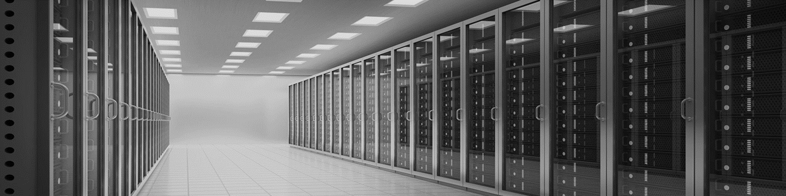

# AppDev Trends

## Secure Infrastructure on Tap - aka the Cloud

The cloud is a great enabler for businesses by providing secure IT infrastructure on tap ... much like any other utility – such as water or electricity - you turn it on / pay for what you consume / expect it just to be there when needed. It enables organisations to be agile, provides scale / resilience and the cloud economics makes it very attractive.

Round the globe, Microsoft lead the cloud with the number of regions having an Azure presence - its currently in over 65+ regions - and any region itself comprises of multiple datacenters. Microsoft has also invested heavily in networks to join up the Azure regions and to interconnect the world.

Azure itself is many services - and it is hard to appreciate the huge breadth of what is available on the Azure platform. The link below takes you to a graphic tool that I use to show the numerous Azure services available, grouped together in categories such as Compute, Networking, Storage, and so on.

&#x2726; <https://azure1.dev>  
&#x2726; <https://infrastructuremap.microsoft.com/>  
