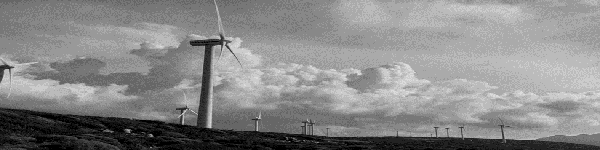

# AppDev Trends

##  Green Software Engineering

At Microsoft, we see sustainability and our response to climate change as one of the greatest challenges of our lifetime. Early last year we made a commitment to be carbon negative by 2030, and by 2050 to have removed from the environment all the carbon the company has ever emitted since it was founded in 1975. Further environmental commitments include reducing our water use intensity (water positive by 2030), reducing our waste (zero waste by 2030), and our support for biodiversity projects and conservation ecosystems.

I believe application developers can play their part here. Green Software Engineering is an emerging discipline with principles, philosophies, and competencies to define, develop, and run sustainable software applications. Sustainable applications are normally cheaper to run, more performant, more resilient and more optimised – but that’s just a welcome addition. The key thing is developing applications in such a manner will have positive impact on the planet.

&#x2726; <https://docs.microsoft.com/learn/modules/sustainable-software-engineering-overview/>  
&#x2726; <https://devblogs.microsoft.com/sustainable-software/>  
&#x2726; <https://azure.microsoft.com/global-infrastructure/sustainability/>  

Video  

